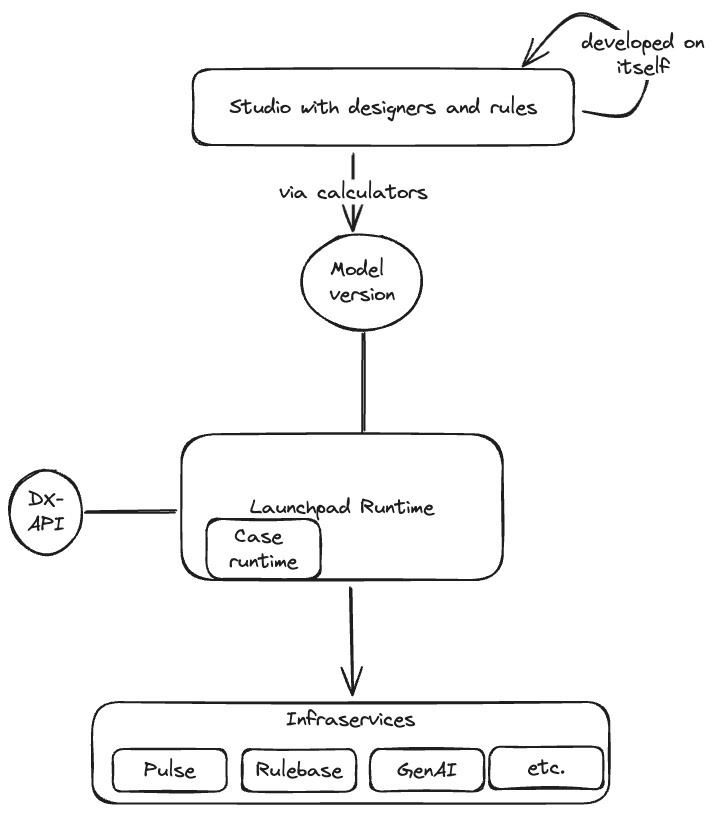

Pega Launchpad provides a language (a way to model your apps) and a runtime which executes it. For example, if you write something in java, then the jvm executes it. Java is a general purpose programming language. This means that any kind of app can be written in java. What if we want to connect to some foriegn third party software? You can do it as long as there is a connector (java library) [either created by the owners or general community] that allows you to connect to that third party software.

Is Pega also a general purpose application development language? May not be. The primary goal of Pega is to help build workflow centric business applications. The more you try to make it generic, the difficult it gets to make it WYSIWYG. 

Can Pega connect to any third party software? Yes, but there are two challenges. One is that we need to write a connector. The other is that you should properly blend this new concept in the pega language in a way that it becomes a natural part. 

The dream of Pega is to enable non technical developers to rapidly build applications in collaboration. But for that you we need to tradeoff the scope of applications that you can create. As long as you are "in-the-model", Pega can guarantee you some nice benefits. But we often see that if you try to do something off mark (like creating LASA), you will run in to so many limitations in the model. You will take to custom out of the model means and thus loose the benefits of Pega. 

I wanted to view the Launchpad runtime as the most basic fundamental block on which the rest of the capabilities are built. For runtime to be the core part of Launchpad, the runtime itself should be exposing the pega model. But runtime actually speaks a very different language. Many of the Pega's advantages are baked in to constellation and the authoring design system. So, the complete LP system is runtime + LASA + constellation. 

But.....

LASA is built on Pega's model. The way it works is the next version of LASA is built on the current version of LASA+runtime+constellation. If there is a feature missing in the pega's model, the new concept must be added in the following way:
1. first runtime is enhanced and new model concept introduced. 
2. The calculators are enhanced. 
3. The Ruletypes are enhanced. 
4. Finally LASA leverages them. 

